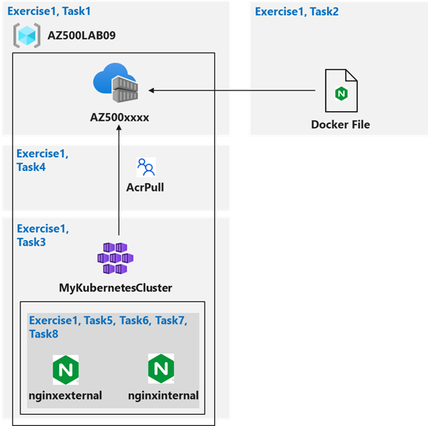

---
lab:
  title: 04 - ACR と AKS の構成とセキュリティ保護
  module: 'Module 01 - Secure compute, storage, and databases'
---

# ラボ 04: ACR と AKS の構成とセキュリティ保護
# 受講生用ラボ マニュアル

## ラボのシナリオ

Azure Container Registry と Azure Kubernetes Service を使用して概念実証をデプロイするよう依頼されました。 具体的には、概念実証は次の例を示す必要があります。

- Dockerfile を使用してイメージをビルドします。
- Azure Container Registry を使用してイメージを格納します。
- Azure Kubernetes Service を構成します。
- コンテナー アプリケーションのセキュリティ保護とアクセスを社内外で行います。 

> このラボのすべてのリソースについて、**米国東部**リージョンを使用しています。 これがクラスで使用するリージョンであることを講師に確認します。 

## ラボの目的

このラボでは、次の演習を行います。

- 演習 1:ACR と AKS の構成とセキュリティ保護

## ACR と AKS の構成とセキュリティ保護の図



## 指示

## ラボ ファイル：

- **\\Allfiles\\Labs\\09\\nginxexternal.yaml**
- **\\Allfiles\\Labs\\09\\nginxinternal.yaml**

### 演習 1:ACR と AKS の構成とセキュリティ保護

### 推定時間:45 分

> このラボのすべてのリソースに対して、**東部 (米国)** リージョンを使用しています。 これがクラスで使用するリージョンであることを講師に確認します。 

この演習では、次のタスクを実行します。

- タスク 1:Azure コンテナー レジストリを作成する
- タスク 2:Dockerfile を作成し、コンテナーを構築して、Azure Container Registry にプッシュする
- タスク 3:Azure Kubernetes Service クラスターを作成する
- タスク 4:AkS クラスターに ACR にアクセスするためのアクセス許可を付与する
- タスク 5:AKS への外部サービスのデプロイ
- タスク 6:外部 AKS ホスト サービスにアクセスできることを確認する
- タスク 7:AKS への内部サービスの展開
- タスク 8:内部 AKS ホスト サービスにアクセスできることを確認する

#### タスク 1:Azure コンテナー レジストリを作成する

このタスクでは、ラボ用リソース グループと Azure Container Registry を作成します。

1. Azure portal **`https://portal.azure.com/`** にサインインします。

    >**注**: このラボで使用する Azure サブスクリプションの所有者または共同作成者のロールと、そのサブスクリプションに関連付けられている Microsoft Entra テナントのグローバル管理者の役割を持つアカウントを使用して、Azure portal にサインインします。

2. Azure portal から、Azure portal の右上にあるアイコンをクリックして、Cloud Shell を開きます。 メッセージが表示されたら、 **[Bash]** と **[ストレージの作成]** をクリックします。

3. Cloud Shell ウィンドウの左上隅にあるドロップダウン メニューで **Bash** が選択されていることを確認します。

4. [Cloud Shell] ウィンドウ内の Bash セッションで、次の手順を実行して、このラボ用の新しいリソース グループを作成します。

    ```sh
    az group create --name AZ500LAB09 --location eastus
    ```

5. [Cloud Shell] ウィンドウ内の Bash セッションで、次の手順を実行して、リソース グループが作成されたことを確認します。

    ```
    az group list --query "[?name=='AZ500LAB09']" -o table
    ```

6. [Cloud Shell] ウィンドウ内の Bash セッションで、次のコマンドを実行して新しい Azure Container Registry (ACR) インスタンスを作成します (ACR の名前はグローバルに一意である必要があります)。 

    ```sh
    az acr create --resource-group AZ500LAB09 --name az500$RANDOM$RANDOM --sku Basic
    ```
    > **注** Azure Container Registry リソース プロバイダーを登録します。 `az acr create` の実行中にエラーが発生した場合は、**Azure Container Registry** サービスがまだサブスクリプションに登録されていないことが原因である可能性があります。 これを修正するには、サービスを登録し、1 つのコマンドでレジストリを作成します。
    
    > ```sh
    > az provider register --namespace Microsoft.ContainerRegistry
    > ```

7. [Cloud Shell] ウィンドウ内の Bash セッションで、次の手順を実行して、新しい ACR が作成されたことを確認します。

    ```sh
    az acr list --resource-group AZ500LAB09
    ```

    >**注**:ACR の名前を記録します。 これは、次のタスクで必要になります。

#### タスク 2:Dockerfile を作成し、コンテナーを構築して、Azure Container Registry にプッシュする

このタスクでは、Dockerfile を作成し、Dockerfile からイメージをビルドして、ACR にイメージをデプロイします。 

1. [Cloud Shell] ウィンドウ内の Bash セッションで、次の手順を実行して Dockerfile を作成し、Nginx ベースのイメージを作成します。 

    ```sh
    echo FROM nginx > Dockerfile
    ```

2. [Cloud Shell] ウィンドウ内の Bash セッションで、次の手順を実行して Dockerfile からイメージを構築し、新しい ACR にイメージをプッシュします。 

    >**注**:コマンド ラインの末尾の後続ピリオドが必要です。 現在のディレクトリを Dockerfile の場所として指定します。 

    ```sh
    ACRNAME=$(az acr list --resource-group AZ500LAB09 --query '[].{Name:name}' --output tsv)

    az acr build --resource-group AZ500LAB09 --image sample/nginx:v1 --registry $ACRNAME --file Dockerfile .
    ```

    >**注**:コマンドが正常に完了するのを待ってください。 これには 2 分ほどかかる場合があります。

3. [Cloud Shell] ペインを閉じます。

4. Azure portal で **AZ500Lab09** リソース グループに移動し、リソースの一覧で、前のタスクでプロビジョニングした Azure Container Registry インスタンスを表すエントリをクリックします。

5. コンテナー レジストリ ブレードの **サービス** セクションで、**レポジトリ** をクリックします。 

6. リポジトリのリストに **sample/nginx** という名前の新しいコンテナー イメージが含まれていることを確認します。

7. **sample/nginx** エントリをクリックし、イメージのバージョンを識別する **v1** タグの存在を確認します。

8. **v1** エントリをクリックして、イメージ マニフェストを表示します。

    >**注**:マニフェストには、sha256 ダイジェスト、マニフェスト作成日、およびプラットフォーム エントリが含まれます。 

#### タスク 3:Azure Kubernetes Service クラスターを作成する

このタスクでは、Azure Kubernetes Service を作成し、デプロイされたリソースを確認します。 

1. Azure portal ページの上部の **[リソース、サービス、ドキュメントの検索]** テキスト ボックスで、**Kubernetes サービス** を入力し **Enter**  キーを押します。

2. **[Kubernetes サービス]** ブレードで、 **[+ 作成]** をクリックし、ドロップダウン メニューで **[+ Kubernetes クラスターを作成]** をクリックします

3. **[Kubernetes クラスターを作成]** ブレードの **[基本]** タブで、 **[クラスターのプリセット構成]** を選び、 **[Dev/Test ($)]** を選びます。 ここで、次の設定を指定します (他の設定は既定値のままにしておきます)。

    |設定|値|
    |----|----|
    |サブスクリプション|このラボで使用している Azure サブスクリプションの名前|
    |リソース グループ|**AZ500LAB09**|
    |Kubernetes クラスター名|**MyKubernetesCluster**|
    |リージョン|**(米国) 米国東部**|
    |可用性ゾーン |**なし**|
    |スケーリング方法|**[手動]**|
    |ノード数|**1**|

4. **[次へ: ノード プール >]** をクリックし **[Kubernetes クラスターを作成]** ブレードの **[ノード プール]** タブで、次の設定を指定します (他の設定は既定値のままにします)。

    |設定|値|
    |----|----|
    |仮想ノードを有効にする|チェックボックスがオフ|
    
5. **[次へ: アクセス >]** をクリックし、 **[Kubernetes クラスターを作成]** ブレードの **[アクセス]** タブで、既定値を受け入れて、 **[次へ:ネットワーク >]** を選択します。 

6. **[Kubernetes クラスターの作成]** ブレードの **[ネットワーク]** タブで、次の設定を指定します (既定値を他のユーザーのままにします)。

    |設定|値|
    |----|----|
    |ネットワーク構成|**Azure CNI オーバーレイ**|
    |DNS 名プレフィックス|**既定値のままにします**|

    >**注**:AKS はプライベート クラスターとして設定できます。 これにより、API サーバーにプライベート IP が割り当てられるため、API サーバーとノード プール間のネットワーク トラフィックがプライベート ネットワーク上にのみ残ります。 詳細については、[Azure Kubernetes Service のプライベート クラスター の作成](https://docs.microsoft.com/en-us/azure/aks/private-clusters)に関するページを参照してください。

7. **[次へ: 統合 >]** をクリックし、 **[Kubernetes クラスターを作成]** ブレードの **[統合]** タブで、 **[コンテナーの監視]** を **[無効]** に設定します。 

    >**注**:運用シナリオでは、監視を有効にします。 この場合、監視はラボでカバーされていないので無効になります。 

8. **[確認と作成]** をクリックしてから、**[作成]** をクリックします。

    >**注**: デプロイが完了するまで待ちます。 これには 10 分ほどかかる場合があります。

9. デプロイが完了したら、Azure portal ページの上部にある **[リソース、サービス、ドキュメントの検索]** テキスト ボックスで、**リソース グループ**と入力し、**Enter** キーを押します。

10. **[リソース グループ]** ブレードのリソース グループの一覧で、AKS ノードのコンポーネントを保持する **MC_AZ500LAB09_MyKubernetesCluster_eastus** という名前の新しいリソース グループをメモします。 このリソース グループのリソースを確認します。 
    
11. **[リソース グループ]** ブレードに戻り、**AZ500LAB09** エントリをクリックします。 

    >**注**:リソースの一覧で、AKS クラスターと対応する仮想ネットワークに注意してください。

12. Azure portal で、 Cloud Shell の Bash セッションを開始します。 

    >**注**:Cloud Shell ウィンドウの左上隅にあるドロップダウン メニューで **Bash** が選択されていることを確認します。

13. [Cloud Shell] ウィンドウ内の Bash セッションで、次の手順を実行して Kubernetes クラスターに接続します。

    ```sh
    az aks get-credentials --resource-group AZ500LAB09 --name MyKubernetesCluster
    ```

14. [Cloud Shell] ウィンドウ内の Bash セッションで、Kubenetes クラスターのノードを一覧表示するには、次の手順を実行します。 

    ```sh
    kubectl get nodes
    ```

    >**注**:クラスタ ノードの**ステータス**が**準備完了**としてリストされていることを確認します。

#### タスク 4:ACRにアクセスし、その仮想ネットワークを管理するためのアクセス許可を AKS クラスターに付与する

このタスクでは、AKS クラスターに ACR にアクセスし、その仮想ネットワークを管理するためのアクセス許可を付与します。 

1. [Cloud Shell] ウィンドウ内の Bash セッションで、このラボで先ほど作成した Azure Container Registry インスタンスを使用するように AKS クラスターを構成するには、次の手順を実行します。 

    ```sh
    ACRNAME=$(az acr list --resource-group AZ500LAB09 --query '[].{Name:name}' --output tsv)

    az aks update -n MyKubernetesCluster -g AZ500LAB09 --attach-acr $ACRNAME
    ```

    >**注**:このコマンドは、ACR に 'acrpull' ロールの割り当てを付与します。 

    >**注**:このコマンドが完了するまでに数分かかる場合があります。 

2. Cloud Shell ペイン内の Bash セッションで、以下を実行して、AKS クラスターにその仮想ネットワークへのコントリビューター ロールを付与します。 

    ```sh
    RG_AKS=AZ500LAB09

    RG_VNET=MC_AZ500LAB09_MyKubernetesCluster_eastus    

    AKS_VNET_NAME=aks-vnet-30198516
    
    AKS_CLUSTER_NAME=MyKubernetesCluster
    
    AKS_VNET_ID=$(az network vnet show --name $AKS_VNET_NAME --resource-group $RG_VNET --query id -o tsv)
    
    AKS_MANAGED_ID=$(az aks show --name $AKS_CLUSTER_NAME --resource-group $RG_AKS --query identity.principalId -o tsv)
    
    az role assignment create --assignee $AKS_MANAGED_ID --role "Contributor" --scope $AKS_VNET_ID
    ```

#### タスク 5:AKS への外部サービスのデプロイ

このタスクでは、マニフェスト ファイルをダウンロードし、YAML ファイルを編集し、変更をクラスターに適用します。 

1. [Cloud Shell] ペイン内の Bash セッションで、 **[ファイルのアップロード/ダウンロード]** アイコンをクリックし、ドロップダウン メニューの **[アップロード]** をクリックして、 **[開く]** ダイアログ ボックスでラボ ファイルをダウンロードした場所に移動します。および **\\Allfiles\\Labs\\09\\nginxexternal.yaml** を選択し、 **[開く]** をクリックします。 次に、 **\\Allfiles\\Labs\\09\\nginxinternal.yaml** を選択し、 **[開く]** をクリックします。

2. [Cloud Shell] ウィンドウ内の Bash セッションで、次のコマンドを実行して、Azure Container Registry インスタンスの名前を識別します。

    ```sh
    echo $ACRNAME
    ```

    >**注**:Azure Container Registry インスタンス名を記録します。 このタスクの後半で必要になります。

3. [Cloud Shell] ウィンドウ内の Bash セッションで、次の手順を実行して nginxexternal.yaml ファイルを開き、その内容を編集できるようにします。 

    ```sh
    code ./nginxexternal.yaml
    ```

    >**注**:これは*外部* yaml ファイルです。

4. [エディター] ペインで、**24 行目**までスクロールし、 **`<ACRUniquename>`** プレースホルダーを ACR 名に置き換えます。

5. [エディター] ウィンドウの右上隅にある **省略記号**アイコンをクリックし、 **[保存]** をクリック して、 **[エディターを閉じる]** をクリックします。 

6. [Cloud Shell] ウィンドウ内の Bash セッションで、次の手順を実行してクラスターに変更を適用します。

    ```sh
    kubectl apply -f nginxexternal.yaml
    ```

7. [Cloud Shell] ウィンドウ内の Bash セッションで、前のタスクで実行したコマンドの出力を確認して、デプロイと対応するサービスが作成されたことを確認します。 

    ```
    deployment.apps/nginxexternal created
    service/nginxexternal created
    ```

#### タスク 6:外部 AKS ホスト サービスにアクセスできることを確認する

このタスクでは、パブリック IP アドレスを使用して、コンテナーに外部からアクセスできることを確認します。

1. [Cloud Shell] ウィンドウ内の Bash セッションで、次のコマンドを実行して、名前、タイプ、IP アドレス、ポートなどの nginxexternal サービスに関する情報を取得します。 

    ```sh
    kubectl get service nginxexternal
    ```

2. [Cloud Shell] ウィンドウ内の Bash セッションで、出力を確認し、[外部 IP] 列に値を記録します。 これは、次のステップで必要になります。 

3. 新しいブラウザー タブを開き、前の手順で特定した IP アドレスを参照します。

4. **Welcome to nginx!** ページが 表示されることを確認します。 

#### タスク 7:AKS への内部サービスの展開

このタスクでは、AKS に内部向けサービスをデプロイします。 

1. [Cloud Shell] ウィンドウ内の Bash セッションで、次の手順を実行して nginxintenal.yaml ファイルを開き、内容を編集できるようにします。 

    ```sh
    code ./nginxinternal.yaml
    ```

    >**注**:これは*内部* yaml ファイルです。

2. [エディター] ペインで、コンテナ イメージへの参照を含む行までスクロールし、 **`<ACRUniquename>`** プレースホルダーを ACR 名に置き換えます。

3. [エディター] ウィンドウの右上隅にある **省略記号**アイコンをクリックし、 **[保存]** をクリック して、 **[エディターを閉じる]** をクリックします。 

4. [Cloud Shell] ウィンドウ内の Bash セッションで、次の手順を実行してクラスターに変更を適用します。

    ```sh
    kubectl apply -f nginxinternal.yaml
    ```

5.  Cloud Shell ウィンドウ内の Bash セッションで、出力を確認してデプロイおよび、サービスが作成されたことを確認します。

    ```
    deployment.apps/nginxinternal created
    service/nginxinternal created
    ```

6. [Cloud Shell] ウィンドウ内の Bash セッションで、次のコマンドを実行して、名前、タイプ、IP アドレス、ポートなどの nginxinternal サービスに関する情報を取得します。 

    ```sh
    kubectl get service nginxinternal
    ```

7. [Cloud Shell] ウィンドウ内の Bash セッションで、出力を確認します。 外部 IP は、この場合はプライベート IP アドレスです。 **保留中**の状態の場合は、前のコマンドを再度実行します。

    >**注**:この IP アドレスを記録します。 これは、次のタスクで必要になります。 

    >**注**:内部サービス エンドポイントにアクセスするには、クラスターで実行されているポッドのいずれかに対話式で接続します。 

    >**注**:または、CLUSTER-IP アドレスを使用することもできます。

#### タスク 8:内部 AKS ホスト サービスにアクセスできることを確認する

このタスクでは、AKS クラスターで実行されているポッドの 1 つを使用して内部サービスにアクセスします。 

1. [Cloud Shell] ウィンドウ内の Bash セッションで、AKS クラスターの既定の名前空間にあるポッドを一覧表示するには、次の手順を実行します。

    ```sh
    kubectl get pods
    ```

2. ポッドの一覧表示で、**NAME** 列の最初の項目をコピーします。

    >**注**:これは、以降の手順で使用するポッドです。

3. [Cloud Shell] ペイン内の Bash セッションで、次の手順を実行して、最初のポッドに対話的に接続します (`<pod_name>` プレースホルダーを前の手順でコピーした名前に置き換えます)。

    ```sh
    kubectl exec -it <pod_name> -- /bin/bash
    ```

4. [Cloud Shell] ペイン内の Bash セッションで、次の手順を実行して、nginx Web サイトがサービスのプライベート IP アドレスを介して利用できることを確認します (`<internal_IP>` プレースホルダーを前のタスクで記録した名前に置き換えます)。

    ```sh
    curl http://<internal_IP>
    ```

5. [Cloud Shell] ペインを閉じます。

> 結果:ACR と AKS を構成し、セキュリティで保護しました。


**リソースをクリーンアップする**

> 新規に作成し、使用しなくなったすべての Azure リソースを削除することを忘れないでください。 使用していないリソースを削除することで、予期しないコストが発生しなくなります。

1. Azure portal から、Azure portal の右上にあるアイコンをクリックして、Cloud Shell を開きます。 

2. [Cloud Shell] ペインの左上のドロップダウン メニューで **[PowerShell]** を選択し、メッセージが表示されたら **[確認]** をクリックします。

3. Cloud Shell ペイン内の PowerShell セッションで、次の手順を実行して、このラボで作成したリソース グループを削除します。
  
    ```powershell
    Remove-AzResourceGroup -Name "AZ500LAB09" -Force -AsJob
    ```

4.  **[Cloud Shell]** ペインを閉じます。 
