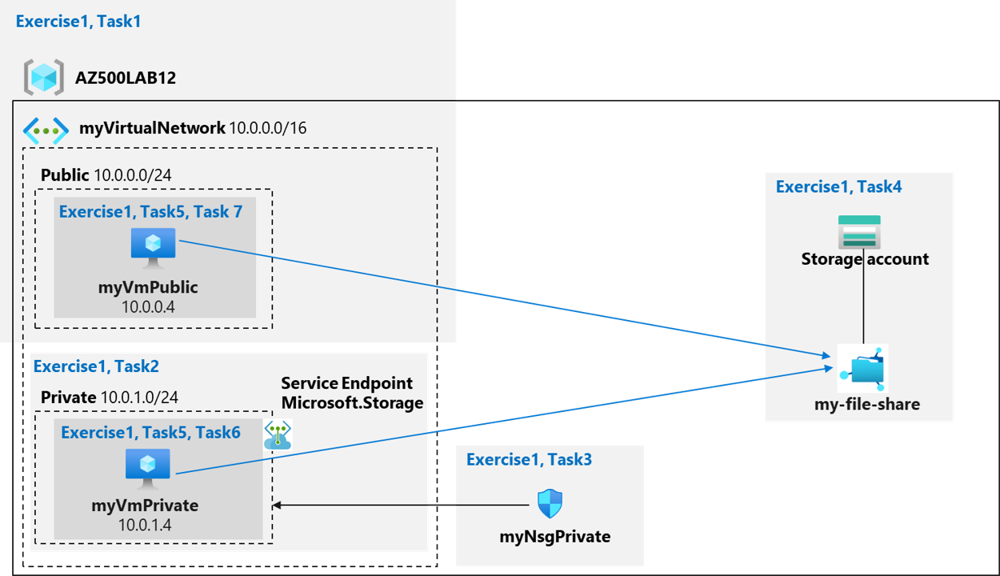

---
lab:
  title: ' 06 - サービス エンドポイントとストレージの保護'
  module: Module 03 - Plan and implement security for Azure SQL Database and Azure SQL Managed Instance
---

# ラボ 06:サービス エンドポイントとストレージの保護
# 受講生用ラボ マニュアル

## ラボのシナリオ

Azure ファイル共有のセキュリティ保護を実証するための概念実証を作成するよう依頼されました。 具体的には、次のことを行います。
    
- Azure Storage に向かうトラフィックが常に Azure バックボーン ネットワーク内にとどまるように、ストレージ エンドポイントを作成します。
- 特定のサブネットのリソースのみがストレージにアクセスできるように、ストレージ エンドポイントを構成します。
- 特定のサブネット外のリソースがストレージにアクセスできないことを確認します。 

> このラボのすべてのリソースについて、**米国東部**リージョンを使用しています。 これがクラスで使用するリージョンであることを講師に確認します。 

## ラボの目的

このラボでは、次の演習を行います。

- 演習 1:サービス エンドポイントとセキュリティ ストレージ

## サービス エンドポイントとストレージの保護の図



## 手順

### 演習 1:サービス エンドポイントとセキュリティ ストレージ

### 推定時間:45 分

この演習では、次のタスクを実行します。

- タスク 1: 仮想ネットワークを作成する
- タスク 2:Virtual Network にサブネットを追加し、ストレージ エンドポイントを構成する
- タスク 3:サブネットへのアクセスを制限するようにネットワーク セキュリティ グループを構成する
- タスク 4: パブリック サブネットで rdp を許可するようにネットワーク セキュリティ グループを構成する
- タスク 5:ファイル共有でストレージ アカウントを作成する
- タスク 6:指定されたサブネットに仮想マシンをデプロイする
- タスク 7:プライベート サブネットからのストレージ接続をテストして、アクセスが許可されていることを確認する
- タスク 8:パブリック サブネットからのストレージ接続をテストして、アクセスが拒否されたことを確認する 

#### タスク 1: 仮想ネットワークを作成する

このタスクでは、Virtual Network を作成します。

1. Azure portal **`https://portal.azure.com/`** にサインインします。

    >**注**:このラボで使用している Azure サブスクリプションで所有者ロールまたは共同作成者ロールを持つアカウントを使用して Azure portal にサインインします。

2. Azure portal で、Azure portal ページの上部にある **[リソース、サービス、ドキュメントを検索する]** テキスト ボックスで、「**Virtual Networks**」と入力し、**Enter** キーを押します。

3. **[Virtual Networks]** ブレードで、 **[+ 作成]** をクリックします。

4. **[仮想ネットワークの作成]** ブレードの **[基本]** タブで、次の設定を指定し (他の設定は既定値のままにします)、 **[次へ:IP アドレス]** をクリックします。

    |設定|値|
    |---|---|
    |サブスクリプション|このラボで使用している Azure サブスクリプションの名前|
    |リソース グループ|**[新規作成]** をクリックし、「**AZ500LAB12**」という名前を入力します|
    |名前|**myVirtualNetwork**|
    |リージョン|**(米国) 米国東部**|

5. 「**Virtual Network の作成**」ブレードの「**IP アドレス**」タブで、「**IPv4 アドレス空間**」を「**10.0.0.0/16**」に設定し、「**サブネット名**」列で「**既定値**」をクリックし、「**サブネットの編集**」ブレードで次の設定を指定して「**保存**」をクリックします。

    |設定|値|
    |---|---|
    |サブネット名|**パブリック**|
    |サブネットのアドレス範囲|**10.0.0.0/24**|

6. **[仮想ネットワークの作成]** ブレードの **[IP アドレス]** タブに戻り、**[確認と作成]** をクリックします。

7. **[仮想ネットワークの作成]** ブレードの **[確認と作成]** タブで、**[作成]** をクリックします。

#### タスク 2:Virtual Network にサブネットを追加し、ストレージ エンドポイントを構成する

このタスクでは、別のサブネットを作成し、そのサブネット上のサービス エンドポイントを有効にします。 サービス エンドポイントはサービスごと、サブネットごとに有効にします。 

1. Azure portal で、**リソース グループ**ブレードに戻ります。

2. **仮想ネットワーク**ブレードで、** myVirtualNetwork **エントリをクリックします。

3. **myVirtualNetwork **ブレードの**設定**セクションで、**サブネット**をクリックします。

4. **[myVirtualNetwork \| サブネット]** ブレードで **[+サブネット]** をクリックします。 

5. **サブネットの追加**ブレードで、次の設定を指定します (他の設定はデフォルト値のままにします)。

    |設定|値|
    |---|---|
    |サブネット名|**プライベート**|
    |サブネットのアドレス範囲|**10.0.1.0/24**|
    |サービス エンドポイント|**既定値の [なし] のままにします**|

6. 「**サブネットの追加**」ブレードで、「**保存**」をクリックして新しいサブネットを追加します。

    >**注**:仮想ネットワークには、次の 2 つのサブネットがあります。パブリックとプライベート。 
    
#### タスク 3:サブネットへのアクセスを制限するようにネットワーク セキュリティ グループを構成する

このタスクでは、2 つの送信セキュリティ規則（ストレージとインターネット）と1つの受信セキュリティ規則（RDP）を持つネットワーク セキュリティ グループを作成します。 また、ネットワーク セキュリティ グループをプライベート サブネットに関連付けます。 これにより、そのサブネットに接続されている Azure VM からの送信トラフィックが制限されます。

1. Azure portal で、Azure portal の上部にある **[リソース、サービス、ドキュメントを検索する]** テキスト ボックスで、「**ネットワーク セキュリティ グループ**」と入力し、**Enter** キーを押します。

2. **[ネットワーク セキュリティ グループ]** ブレードで、**[+ 作成]** をクリックします。

3. **[ネットワーク セキュリティ グループの作成]** ブレードの **[基本]** タブで、次の設定を指定します。 

    |設定|値|
    |---|---|
    |サブスクリプション|このラボで使用している Azure サブスクリプションの名前|
    |リソース グループ|**AZ500LAB12**|
    |名前|**myNsgPrivate**|
    |リージョン|**米国東部**|

4. **[Review + create]\(レビュー + 作成\)** をクリックし、 **[作成]** をクリックします。

    >**注**:次の手順では、Azure Storage サービスとの通信を許可する送信セキュリティ規則を作成します。 

5. Azure portal で、「**ネットワーク セキュリティ グループ**」ブレードに戻り、**myNsgPrivate** エントリをクリックします。

6. 「**myNsgPrivate**」ブレードの「**設定**」セクションで、「**送信セキュリティ規則**」をクリックします。

7. **[myNsgPrivate \| 送信セキュリティ規則]** ブレードで、 **[+ 追加]** をクリックします。

8. 「**送信セキュリティ規則の追加**」ブレードで、次の設定を指定して、Azure Storage への送信トラフィックを明示的に許可します (他のすべての値をデフォルト設定のままにします)。 

    |設定|値|
    |---|---|
    |source|**サービス タグ**|
    |発信元サービス タグ|**VirtualNetwork**|
    |Source port ranges|**\***|
    |到着地|**サービス タグ**|
    |宛先サービス タグ|**Storage**|
    |宛先ポート範囲|**\***|
    |プロトコル|**[任意]**|
    |アクション|**許可**|
    |Priority|**1000**|
    |名前|**Allow-Storage-All**|

9. **[送信セキュリティ ルールの追加]** ブレードで、 **[追加]** をクリックして新しい送信ルールを作成します。 

10. 「**myNsgPrivate**」ブレードの「**設定**」セクションで、「**送信セキュリティ規則**」をクリックし、「 **+ 追加**」をクリックします。

11. 「**送信セキュリティ規則の追加**」ブレードで、インターネットへの送信トラフィックを明示的に拒否するように次の設定を指定します (他の設定はすべて既定値のままにします) 

    |設定|値|
    |---|---|
    |source|**サービス タグ**|
    |発信元サービス タグ|**VirtualNetwork**|
    |Source port ranges|**\***|
    |到着地|**サービス タグ**|
    |宛先サービス タグ|**Internet**|
    |宛先ポート範囲|**\***|
    |プロトコル|**[任意]**|
    |アクション|**Deny**|
    |Priority|**1100**|
    |名前|**Deny-Internet-All**|

    >**注**:この規則は、送信インターネット通信を許可するすべてのネットワーク セキュリティ グループの既定の規則を上書きします。 

    >**注**:次の手順では、サブネットへのリモート デスクトップ プロトコル (RDP) トラフィックを許可する受信セキュリティ規則を作成します。 この規則は、インターネットからのすべての受信トラフィックを拒否する既定のセキュリティ規則をオーバーライドします。 サブネットへのリモート デスクトップ接続が許可されているため、後の手順で接続をテストできます。

12. **[myNsgPrivate]** ブレードの **[設定]** セクションで、 **[送信セキュリティ規則]** をクリックし、 **[+ 追加]** をクリックします。

13. 「**受信セキュリティ規則の追加**」ブレードで、次の設定を指定します (他の値はすべて既定値のままにします)。 

    |設定|値|
    |---|---|
    |source|**[任意]**|
    |ソース ポート範囲|**\***|
    |到着地|**サービス タグ**|
    |宛先サービス タグ|**VirtualNetwork**|
    |宛先ポート範囲|**3389**|
    |Protocol|**TCP**|
    |アクション|**許可**|
    |Priority|**1200**|                                                    
    |名前|**Allow-RDP-All**|

14. **[受信セキュリティ規則の追加]** ブレードで、**[追加]** をクリックして新しい受信規則を作成します。 

    >**注**:次に、ネットワーク セキュリティ グループを Private サブネットに関連付けます。

15. 「**サブネット**」ブレードで、「 **+ 関連付け**」を選択し、「**サブネットの関連付け**」セクションで次の設定を指定してから、「**OK**」をクリックします。

    |設定|値|
    |---|---|
    |仮想ネットワーク|**myVirtualNetwork**|
    |Subnet|**プライベート**|

#### タスク 4: パブリック サブネットで rdp を許可するようにネットワーク セキュリティ グループを構成する

このタスクでは、受信セキュリティ規則 (RDP) なしでネットワーク セキュリティ グループを作成します。 また、ネットワーク セキュリティ グループをパブリック サブネットに関連付けます。 これにより、パブリック VM への RDP アクセスが許可されます。

1. Azure portal で、Azure portal の上部にある **[リソース、サービス、ドキュメントを検索する]** テキスト ボックスで、「**ネットワーク セキュリティ グループ**」と入力し、**Enter** キーを押します。

2. **[ネットワーク セキュリティ グループ]** ブレードで、**[+ 作成]** をクリックします。

3. **[ネットワーク セキュリティ グループの作成]** ブレードの **[基本]** タブで、次の設定を指定します。 

    |設定|値|
    |---|---|
    |サブスクリプション|このラボで使用している Azure サブスクリプションの名前|
    |リソース グループ|**AZ500LAB12**|
    |名前|**myNsgPublic**|
    |リージョン|**米国東部**|

4. **[Review + create]\(レビュー + 作成\)** をクリックし、 **[作成]** をクリックします。

    >**注**:次の手順では、Azure Storage サービスとの通信を許可する送信セキュリティ規則を作成します。 

5. Azure portal で、「**ネットワーク セキュリティ グループ**」ブレードに戻り、「**myNsgPublic**」エントリをクリックします。

6. 「**myNsgPublic**」ブレードの「**設定**」セクションで、「**受信セキュリティ規則**」をクリックしてから、「 **+ 追加**」をクリックします。

7. 「**受信セキュリティ規則の追加**」ブレードで、次の設定を指定します (他の値はすべて既定値のままにします)。 

    |設定|値|
    |---|---|
    |source|**[任意]**|
    |ソース ポート範囲|**\***|
    |到着地|**サービス タグ**|
    |宛先サービス タグ|**VirtualNetwork**|
    |宛先ポート範囲|**3389**|
    |Protocol|**TCP**|
    |アクション|**許可**|
    |Priority|**1200**|                                                    
    |名前|**Allow-RDP-All**|

8. **[受信セキュリティ規則の追加]** ブレードで、**[追加]** をクリックして新しい受信規則を作成します。 

    >**注**:次に、ネットワーク セキュリティ グループを Public サブネットに関連付けます。

9. 「**サブネット**」ブレードで、「 **+ 関連付け**」を選択し、「**サブネットの関連付け**」セクションで次の設定を指定してから、「**OK**」をクリックします。

    |設定|値|
    |---|---|
    |仮想ネットワーク|**myVirtualNetwork**|
    |Subnet|**パブリック**|
    
#### タスク 5:ファイル共有でストレージ アカウントを作成する

このタスクでは、ファイル共有を使用してストレージ アカウントを作成し、ストレージ アカウント キーを取得します。  

1. Azure portal の「**リソース、サービス、ドキュメントの検索**」テキスト ボックスで、Azure portal ページの上部に「**ストレージ アカウント**」と入力し、**Enter** キーを押します。

2. **[ストレージ アカウント]** ブレードで  **[+ 作成]** をクリックします。

3. 「**ストレージ アカウントの作成**」ブレードの「**基本**」タブで、次の設定を指定します (他の設定は既定値のままにします)。

    |設定|値|
    |---|---|
    |サブスクリプション|このラボで使用している Azure サブスクリプションの名前|
    |リソース グループ|**AZ500LAB12**|
    |ストレージ アカウント名|文字と数字で構成される、長さが 3 から 24 のグローバルに一意の名前|
    |場所|**(米国) EastUS**|
    |パフォーマンス|**Standard (汎用 v2 アカウント)**|
    |冗長性|**ローカル冗長ストレージ (LRS)**|

4. 「**ストレージ アカウントの作成**」ブレードの「**基本**」タブで、「**Review + Create**」をクリックし、検証プロセスが完了するのを待ってから、「**作成**」をクリックします。

    >**注**:ストレージ アカウントが作成されるのを待ちます。 これには 2 分ほどかかります。

5. Azure portal で、Azure portal ページの上部にある **[リソース、サービス、ドキュメントを検索する]** テキスト ボックスで、「**リソース グループ**」と入力し、**Enter** キーを押します。

6. **[リソース グループ]** ブレードのリソース グループの一覧で、 **[AZ500LAB12]** エントリをクリックします。

7. **AZ500LAB12** リソース グループ ブレードのリソース リストで、新しく作成されたストレージ アカウントを表すエントリをクリックします。

8. ストレージ アカウントの **[概要]** ブレードで、 **[データ ストレージ]** タブの **[ファイル共有]** をクリックし、 **[+ ファイル共有]** をクリックします。

9. **[新しいファイル共有]** ブレードで、バックアップ タブにある **[バックアップを有効にする]** オプションのチェックを外します。 

10. 「**新しいファイルの共有**」ブレードで、次の設定を指定します。

    |設定|値|
    |---|---|
    |名前|**my-file-share**|

11. **新しいファイル共有**ブレードで、**作成**をクリックします。

    >**注**:次に、Azure ファイル共有へのドライブ マッピングを作成する PowerShell スクリプトを取得して記録します。 

12. 「ストレージ アカウント」ブレードで、「ファイル共有の一覧」から、「**my-file-share**」をクリックします。

13. 「**my-file-share**」ブレードで、「**接続**」をクリックします。

14. 「**接続**」ブレードの「**Windows**」タブで、ファイル共有への Z ドライブのマッピングを作成する PowerShell スクリプトをコピーします。 

    >**注**:このスクリプトを記録します。 このラボの後半で、**Private** サブネット上の Azure Virtual Machine からファイル共有をマッピングするために、これが必要になります。

15. ストレージ アカウント ブレードに戻り、**[セキュリティ + ネットワーク]** セクションで、**[ネットワーク]** をクリックします。

16. **[パブリック ネットワーク アクセス]** で **[管理]** を選択し、**[既定のアクション]** として **[選択したネットワークから有効にする]** を選択します。

17. **[リソースの設定: 仮想ネットワーク、IP アドレス、例外]** ブレードで、**[表示]** を選択し、**[+ 既存の仮想ネットワークの追加]** リンクをクリックします。 

18. **[ネットワークの追加]** ブレードで、次の設定を指定します。

    |設定|値|
    |---|---|
    |サブスクリプション|このラボで使用している Azure サブスクリプションの名前|
    |仮想ネットワーク|**myVirtualNetwork**|
    |サブネット|**プライベート**|

19. **[ネットワークの追加]** ブレードで、 **[+ 追加]** をクリックします。 

20. ストレージ アカウントのブレードに戻り、「**保存**」をクリックします。

    >**注**:ラボのこの時点で、仮想ネットワーク、ネットワーク セキュリティ グループ、およびファイル共有のあるストレージ アカウントを構成しました。 

#### タスク 6:指定されたサブネットに仮想マシンをデプロイする

このタスクでは、プライベート サブネットとパブリック サブネットに 1 つずつ、2 つの仮想マシンを作成します。 

>**注**:最初の仮想マシンはプライベート サブネットに接続されます。

1. Azure portal で、Azure portal の上部にある **[リソース、サービス、ドキュメントを検索する]** テキスト ボックスで、「**Virtual Machines**」と入力し、**Enter** キーを押します。

2. **[仮想マシン]** ブレードで、 **[+ 作成]** をクリックし、ドロップダウン リストで **[+ Azure Virtual Machine]** をクリックします

3. **[仮想マシンの作成]** ブレードの **[基本]** タブで、以下の設定を指定します (他の設定は既定値のまま)。

    |設定|値|
    |---|---|
    |サブスクリプション|このラボで使用する Azure サブスクリプションの名前|
    |リソース グループ|**AZ500LAB12**|
    |仮想マシン名|**myVmPrivate**|
    |リージョン|**(US)East US**|
    |Image|**Windows Server 2022 Datacenter:Azure Edition - Gen 2**|
    |ユーザー名|**Student**|
    |パスワード|**ラボ 02 > 演習 2 > タスク 1 > 手順 3 で作成した自分の個人用パスワードを使ってください。**|
    |パブリック受信ポート|**なし**|
    |すでに Windows サーバーのライセンスを持っています|**オフ**|

    >**注**:公開の受信ポートの場合、事前に作成された NSG に依存します。 

4. **[次へ: ディスク >]** をクリックし、 **[仮想マシンの作成]** ブレードの **[ディスク]** タブで、 **[OS ディスクの種類]** を **[Standard HDD]** に設定し、 **[次へ:ネットワーク >]** を選択します。

5. **[次へ: ネットワーク >]** をクリックし、 **[仮想マシンの作成]** ブレードの **[ネットワーク]** タブで、次の設定を指定します (他の設定は既定値のままにします)。

    |設定|値|
    |---|---|
    |仮想ネットワーク|**myVirtualNetwork**|
    |Subnet|**[プライベート (10.0.1.0/24)]**|
    |パブリック IP|**(新規)myVmPrivate-ip**|
    |NIC ネットワーク セキュリティ グループ|**なし**|

6. **[次へ: 管理 >]** をクリックし、 **[仮想マシンの作成]** ブレードの **[管理]** タブで、既定の設定を受け入れ、 **[確認および作成]** をクリックします。

7. 「**Review + create**」ブレードで検証が成功したことを確認して、「**作成**」をクリックします。

    >**注**:2 番目の仮想マシンは公開サブネットに接続されます。

8. **[仮想マシン]** ブレードで、 **[+ 追加]** をクリックし、ドロップダウン リストで **[+ Azure Virtual Machine]** をクリックします。

9. **[仮想マシンの作成]** ブレードの **[基本]** タブで、以下の設定を指定します (他の設定は既定値のまま)。

    |設定|値|
    |---|---|
    |サブスクリプション|このラボで使用する Azure サブスクリプションの名前|
    |リソース グループ|**AZ500LAB12**|
    |仮想マシン名|**myVmPublic**|
    |リージョン|**(US)East US**|
    |Image|**Windows Server 2022 Datacenter:Azure Edition - Gen 2**|
    |ユーザー名|**Student**|
    |パスワード|**ラボ 02 > 演習 1 > タスク 1 > 手順 9 で作成した個人用パスワードを使用してください。**|
    |パブリック受信ポート|**なし**|
    |すでに Windows サーバーのライセンスを持っています|**オフ**|

    >**注**:公開の受信ポートの場合、事前に作成された NSG に依存します。 

10. **[次へ: ディスク >]** をクリックし、 **[仮想マシンの作成]** ブレードの **[ディスク]** タブで、 **[OS ディスクの種類]** を **[Standard HDD]** に設定し、 **[次へ:ネットワーク >]** を選択します。

11. **[次へ: ネットワーク >]** をクリックし、 **[仮想マシンの作成]** ブレードの **[ネットワーク]** タブで、次の設定を指定します (他の設定は既定値のままにします)。

    |設定|値|
    |---|---|
    |仮想ネットワーク|**myVirtualNetwork**|
    |Subnet|**[パブリック (10.0.0.0/24)]**|
    |パブリック IP|**(新規)myVmPublic-ip**|
    |NIC ネットワーク セキュリティ グループ|**なし**|

12. **[次へ: 管理 >]** をクリックし、 **[仮想マシンの作成]** ブレードの **[管理]** タブで、既定の設定を受け入れ、 **[確認および作成]** をクリックします。

13. 「**Review + create**」ブレードで検証が成功したことを確認して、「**作成**」をクリックします。

    >**注**: **myVMPrivate** Azure VM のデプロイが完了したら、次のタスクに進むことができます。

#### タスク 7:プライベート サブネットからのストレージ接続をテストして、アクセスが許可されていることを確認する

このタスクでは、リモート デスクトップ経由で myVMPrivate 仮想マシンに接続し、ドライブをファイル共有にマップします。 

1. **Virtual Machines** ブレードに移動します。 

2. 「**Virtual Machines**」ブレードで、「**myVMPrivate**」エントリをクリックします。

3. **myVMPrivate** ブレードで、**[接続]** をクリックし、ドロップダウン メニューの **[接続]** をクリックします。 

4. RDP ファイルをダウンロードし、それを使用してリモート デスクトップ経由で **myVMPrivate** Azure VM に接続します。 認証を求めるプロンプトが表示されたら、次の認証情報を入力します。

    |設定|値|
    |---|---|
    |ユーザー名|**Student**|
    |パスワード|**ラボ 02 > 演習 2 > タスク 1 > 手順 3 で作成した自分の個人用パスワードを使ってください。**|
     

    >**注**:リモート デスクトップ セッションが開き、サーバー マネージャーが読み込まれるまで待ってください。

    >**注**:ドライブ Z を Windows Server 2022 のコンピューターのリモート デスクトップ セッション内の Azure ファイル共有にマップします

5. **myVMPrivate** へのリモート デスクトップ セッション内で、「**起動する**」をクリックし、「**Windows PowerShell ISE**」をクリックします。

6. **Windows PowerShell ISE** ウィンドウで、 **スクリプト**ウィンドウを開き、このラボで前に記録した PowerShell スクリプトを貼り付けて実行します。 スクリプトの形式は次のとおりです

    ```powershell
    $connectTestResult = Test-NetConnection -ComputerName <storage_account_name>.file.core.windows.net -Port 445
    if ($connectTestResult.TcpTestSucceeded) {
       # Save the password so the drive will persist on reboot
       cmd.exe /C "cmdkey /add:`"<storage_account_name>.file.core.windows.net`" /user:`"localhost\<storage_account_name>`"  /pass:`"<storage_account_key>`""
       # Mount the drive
       New-PSDrive -Name Z -PSProvider FileSystem -Root "\\<storage_account_name>.file.core.windows.net\my-file-share" -Persist
    } else {
       Write-Error -Message "Unable to reach the Azure storage account via port 445. Check to make sure your organization or ISP is not blocking port 445, or use Azure P2S VPN, Azure S2S VPN, or Express Route to tunnel SMB traffic over a different port."
    }
    ```
    >**注**:`<storage_account_name>` プレースホルダーは、ファイル共有をホストするストレージ アカウントの名前を表し、`<storage_account_key>` はそのプライマリ キーを表します

7. Explorer を起動して、Z: ドライブのマッピングが正常に作成されたことを確認します。

8. 次に、**Windows PowerShell ISE** コンソールのコンソール ウィンドウから次を実行して、仮想マシンがインターネットに送信接続がないことを確認します。

    ```powershell
    Test-NetConnection -ComputerName www.bing.com -Port 80
    ```

    >**注**:非公開のサブネットに関連付けられているネットワーク セキュリティ グループがインターネットへの発信アクセスを許可していないため、テストは失敗します。

9. **myVmPrivate** Azure VM へのリモート デスクトップ セッションを終了します。

    >**注**:この時点で、非公開のサブネット内の仮想マシンがストレージ アカウントにアクセスできることを確認しました。 

####  タスク 8:パブリック サブネットからのストレージ接続をテストして、アクセスが拒否されたことを確認する 

1. **Virtual Machines** ブレードに移動します。 

2. **Virtual Machines** ブレードで、「**myVMPublic**」エントリをクリックします。

3. **[myVMPublic]** ブレードで、**[接続]** をクリックし、ドロップダウン メニューの **[接続]** をクリックします。 

4. **[RDP で接続]** をクリックし、それを使用して、リモート デスクトップ経由で **myVMPublic** Azure VM に接続します。 認証を求めるプロンプトが表示されたら、次の認証情報を入力します。

    |設定|値|
    |---|---|
    |ユーザー名|**Student**|
    |パスワード|**ラボ 02 > 演習 2 > タスク 1 > 手順 3 で作成した自分の個人用パスワードを使ってください。**|


    >**注**:リモート デスクトップ セッションが開き、サーバー マネージャーが読み込まれるまで待ってください。

    >**注**:ドライブ Z を Windows Server 2022 のコンピューターのリモート デスクトップ セッション内の Azure ファイル共有にマップします

5. **myVMPublic** へのリモート デスクトップ セッションで、「**スタート**」をクリックして、**Windows PowerShell ISE** をクリックします。

6. **Windows PowerShell ISE** ウィンドウで「**スクリプト**」ペインを開き、リモート デスクトップ セッション内で実行したのと同じ PowerShell スクリプトを **myVMPrivate Azure VM** に貼り付けて実行します。

    >**注**:今回は、"**New-PSDrive :アクセスが拒否されました**" というエラーを受け取ります。 

    >**注**:仮想マシン *myVmPublic* がパブリック サブネットにデプロイされているため、アクセスが拒否されています。 パブリック サブネットには、Azure Storage に対応したサービス エンドポイントがありません。 ストレージ アカウントは、プライベート サブネットからのネットワーク アクセスのみ許可します。

7. 次に、**Windows PowerShell ISE** のコンソール画面から以下を実行して、仮想マシンがインターネットへの外向きの送信ができるように接続されていることを確認します。 

    ```powershell
    Test-NetConnection -ComputerName www.bing.com -Port 80
    ```

    >**注**: パブリック サブネット上のインターネットを拒否する送信セキュリティ規則がないため、テストは成功します。

8. Azure VM **myVmPublic** へのリモート デスクトップ セッションを閉じます。

    >**注**:この時点で、パブリック サブネット内の仮想マシンはストレージ アカウントにアクセスできず、インターネットにアクセス可能であることを確認しました。


**リソースをクリーンアップする**

> 新規に作成し、使用しなくなったすべての Azure リソースを削除することを忘れないでください。 使用していないリソースを削除することで、予期しないコストが発生しなくなります。 
